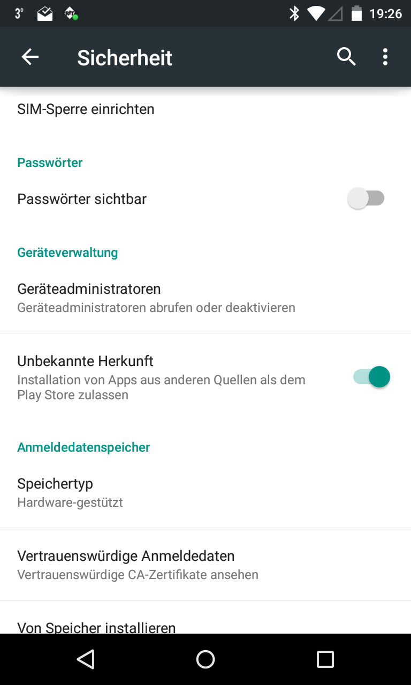

# Deployment

Deployment is pretty easy. Just checkout the GitHub Repository and import the Project in your [Android Studio](https://developer.android.com/sdk/installing/studio.html). 

## Install from APK

You can download the latest **[APK](smart_sense_tracker.apk)** Release and install the App directly on your Smartphone.

Therefore you must enable *untrusted Apps* (*Unbekannte Herkunft*) under the Security Settings.

{: style="max-width: 200px"}


## Build with Android Studio

### The Smartphone App

Just Deploy the *app* module to your smartphone. Make sure the loggingBackend Module is properly declared as Dependency.  

You need:

* build Tools Version 21.1.1
* min-sdk Verion 20 (aka KitKat)


### The Wearable App

Just Deploy the *wear* module to your smartwatch. Make sure the loggingBackend Module is properly declared as Dependency.  

You need:

* build Tools Version 21.1.1
* sdk Version 20 (aka 4.4W2)


## The Server

The App supports the Upload directly to your Webserver. Therefore you've only to provide your Server Address an Port to your Study Participants.
The following NodeJS Server is a simple (functional) example.

```
var express = require('express');
var app = express();
var fs = require('fs');
var mkdirp = require('mkdirp');
var multipart = require('connect-multiparty');
var multipartMiddleware = multipart();

var uploadDir = "/home/martin/www/uploads/";

app.use(multipartMiddleware);

app.post('/upload/:sid/:username', multipartMiddleware, function(req, res) {
    console.log(req.body, req.files);
    console.log(req.params.sid, req.params.username);

    var fullDir = uploadDir + req.params.username + "/" + req.params.sid + "/";
    var fileName = req.files.source.name;
    console.log(fullDir);

    mkdirp(uploadDir + req.params.username + "/", function (err) {
        if (err){
            console.error(err)
            res.send(400, "Server Writting No Good");
        }
        else{
            mkdirp(fullDir, function (err) {
                if (err){
                    console.error(err)
                    res.send(400, "Server Writting No Good");
                }
                else{
                    fs.rename(
                        req.files.source.path,
                            fullDir+fileName,
                        function(err){
                            if(err != null){
                                console.log(err)
                                res.send(400, "Server Writting No Good");
                            } else {
                                res.send("ok!");
                            }
                        }
                    );
                }
            });
        }
    });
});

app.listen(8080);
console.log('connected to localhost....')
```